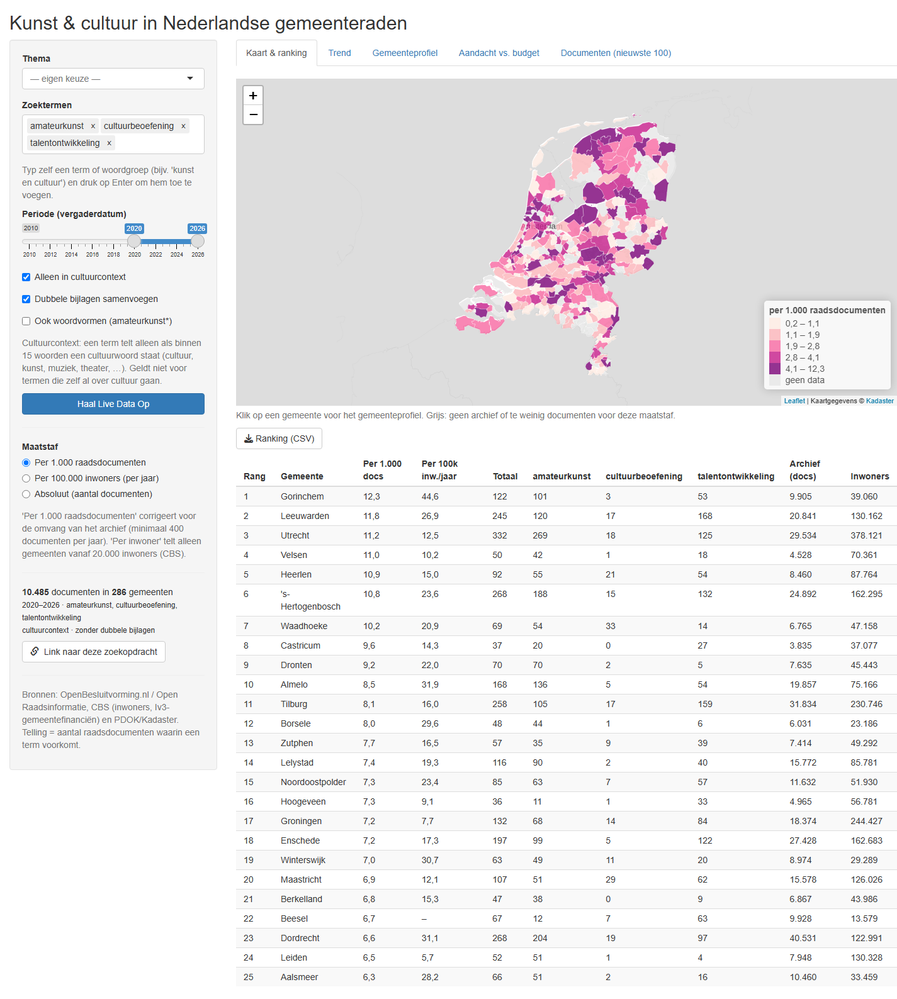
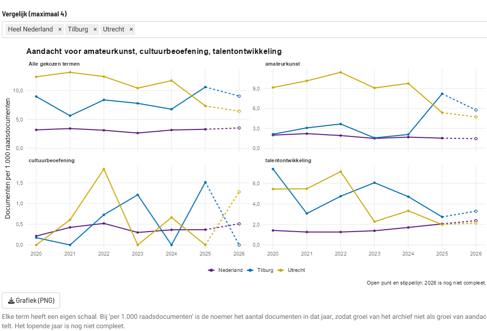
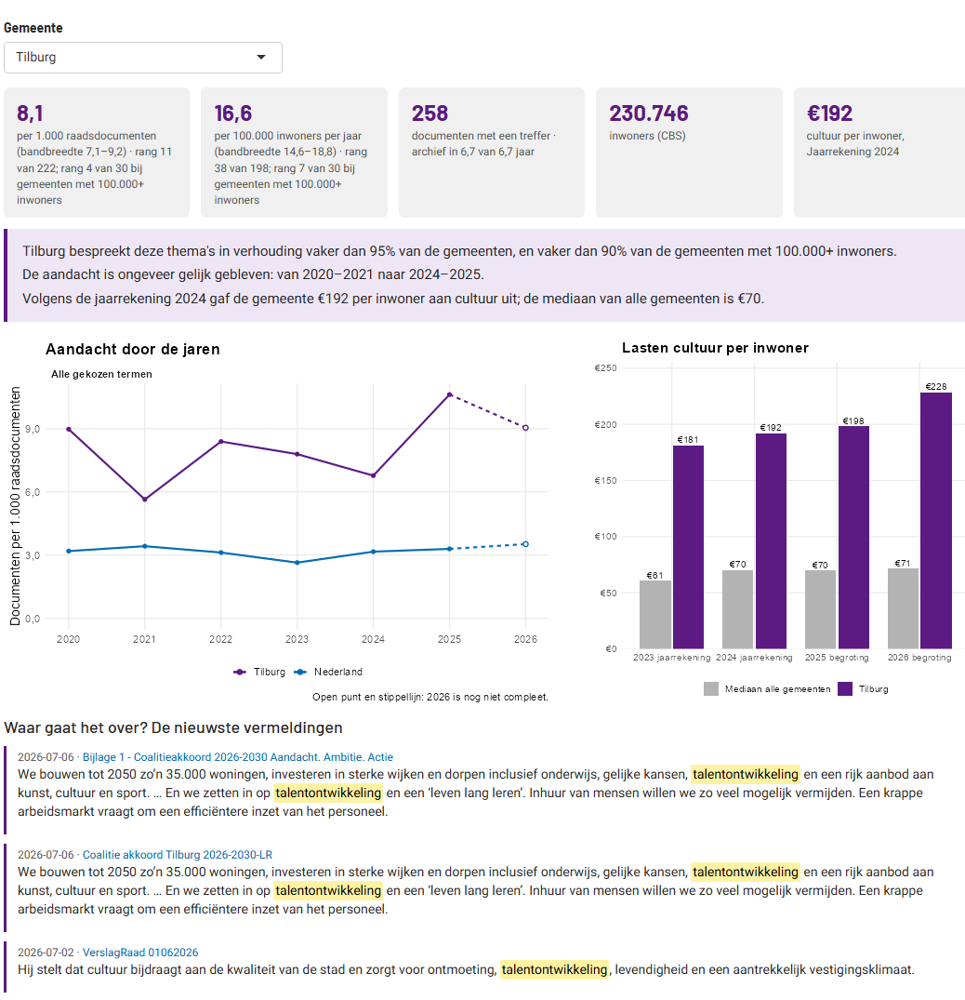
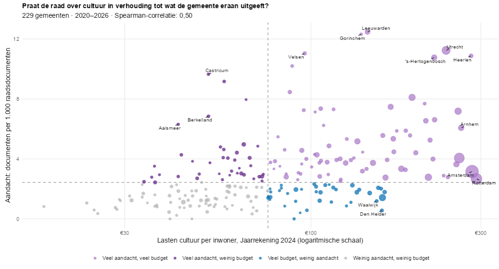

# Cultuur in de raad

Hoe vaak praten Nederlandse gemeenteraden over amateurkunst, cultuureducatie,
cultuurbeoefening en verwante onderwerpen? En hoe verhoudt die aandacht zich
tot wat een gemeente aan cultuur uitgeeft?

Dit is een R Shiny-dashboard dat **live** de raadsdocumenten van ongeveer 290
gemeenten doorzoekt via [OpenBesluitvorming.nl](https://openbesluitvorming.nl),
en die combineert met open data van het CBS en PDOK. Alle bronnen zijn gratis
en hebben geen API-sleutel nodig.

**[Open het dashboard](https://01a0d57f-3a32-a4ab-9874-1761a480a727.share.connect.posit.cloud/)** ·
[Projectpagina](https://alex-janse.github.io/cultuur-in-de-raad/)

De app staat op Posit Connect Cloud (gratis). Bij de eerste bezoeker na een
stille periode moet hij even opstarten.



## Wat kun je ermee?

- **Zoeken op thema's of eigen termen**: kies een themaset (zoals
  *Cultuurparticipatie*) of typ zelf een term of woordgroep.
- **Kaart en ranking**: alle gemeenten ingekleurd naar aandacht. Je kiest de
  maatstaf:
  - per 1.000 raadsdocumenten, wat corrigeert voor de omvang van het archief;
  - per 100.000 inwoners;
  - absoluut.
- **Trend**: aandacht per jaar, met een eigen grafiek per term. Vergelijk tot
  vier gemeenten met heel Nederland.
- **Gemeenteprofiel**: klik op een gemeente voor:
  - de kerncijfers;
  - de trend naast die van Nederland;
  - de cultuurlasten per inwoner van 2023 tot en met 2026;
  - de nieuwste vermeldingen, met de zin waarin de term staat.
- **Aandacht vs. budget**: welke gemeenten praten veel over cultuur maar geven
  er weinig aan uit, en omgekeerd?
- **Export en delen**: tabellen als CSV (Excel-vriendelijk), grafieken als PNG,
  en een link die je zoekopdracht bewaart.

| Trend | Gemeenteprofiel |
|---|---|
|  |  |



## Starten

Je hebt R 4.4 of nieuwer nodig. Installeer eenmalig de pakketten:

```r
install.packages(c("shiny", "httr2", "jsonlite", "dplyr", "tidyr", "leaflet",
                   "ggplot2", "ggrepel", "cbsodataR", "sf", "cachem"))
```

Start daarna de app vanuit deze map:

```r
shiny::runApp()
```

Klik op **Haal Live Data Op**.

### Snel laden dankzij een nachtelijke berekening

Elke nacht rekent een GitHub Action
([`voorbereken.yml`](.github/workflows/voorbereken.yml)) de volgende zoekvragen
vooraf uit:

- de standaardtermen;
- elke themaset, met de standaardperiode en de standaardinstellingen;
- de CBS-cijfers en de gemeentegrenzen.

De uitkomsten komen op de tak [`data`](../../tree/data) van deze repository.
De app leest die eerst. Zo'n zoekvraag laadt daardoor direct, en de API van
OpenBesluitvorming wordt minder belast.

Alleen andere termen, perioden of instellingen gaan live naar de API. Dat
duurt ongeveer 15 seconden. Daarna blijft het resultaat een uur in het
geheugen.

De berekening kun je ook zelf starten, via het tabblad *Actions* op GitHub of
lokaal:

```r
source("scripts/voorbereken.R")   # of: Rscript scripts/voorbereken.R uitvoer
```

Tests draaien:

```r
testthat::test_dir("tests/testthat")
```

## Hoe wordt er geteld?

- **Telling**: het aantal raadsdocumenten (stukken, bijlagen, agendapunten)
  waarin een term voorkomt, niet het aantal keer dat de term genoemd wordt.
  De term wordt gezocht als exacte woordgroep in de titel, de beschrijving en
  de volledige tekst.
- **Dubbele bijlagen samenvoegen** (standaard aan): dezelfde bijlage hangt
  vaak bij meerdere agendapunten. Binnen een gemeente tellen bestanden met
  precies dezelfde grootte één keer; dat geldt voor de treffers én voor de
  noemer.
  - Dat scheelt ongeveer 15% van de treffers en 10% van het archief.
  - De naam is geen goede sleutel, want veel bestanden heten "Bijlage 1.pdf".
  - Gemeten (september 2026): het effect hangt niet samen met de grootte van
    het archief (correlatie −0,02). Grote gemeenten worden er dus niet door
    bevoordeeld.
  - Toevallig even grote, verschillende bestanden komen weinig voor: in
    Utrecht (2024) hooguit ~2%.
  - De landelijke trend is de som van de gemeenten, zodat identieke stukken
    van verschillende gemeenten niet worden samengevoegd.
- **Alleen in cultuurcontext** (standaard aan): een term die zelf niet over
  cultuur gaat (zoals *talentontwikkeling* of *bedrijfscultuur*) telt alleen
  als binnen 15 woorden een cultuurwoord staat (cultuur, kunst, muziek,
  theater, museum, erfgoed, …). Dat geldt in de titel, de beschrijving en de
  tekst. Zonder deze eis gaat twee derde van de treffers voor
  *talentontwikkeling* over sport, onderwijs of jeugd.
- **Woordvormen** (optioneel, voor termen vanaf 4 letters): *amateurkunst*
  vindt dan ook *amateurkunstenaars*.
- **Jaren met archief**: per gemeente tellen alleen de jaren mee waarin het
  archief minstens 50 documenten heeft, en het lopende jaar naar rato. Zo
  worden gemeenten met een later begonnen of onvolledig archief niet
  benadeeld. Het profiel en de ranking tonen vanaf welk jaar er een archief is.
- **Per 1.000 raadsdocumenten**: de noemer is het aantal documenten van die
  gemeente in dezelfde periode. Gemeenten met minder dan 400 documenten per
  jaar met archief tellen bij deze maatstaf niet mee.
- **Per 100.000 inwoners per jaar**: gedeeld door de jaren met archief, en
  alleen voor gemeenten vanaf 20.000 inwoners. Kleinere gemeenten produceren
  ongeveer evenveel raadsstukken en zouden anders bovenaan staan.
- **Bandbreedte en ranking**: bij elke waarde staat een 95%-interval (exact
  Poisson). Bij weinig treffers is dat breed. Gemeenten met minder dan 10
  treffers krijgen geen rang, omdat hun plek vooral toeval is. Een gemeente
  met archief maar 0 treffers telt als echte nul.
- **Validatie**: met [`scripts/validatie.R`](scripts/validatie.R) trek je per
  term een willekeurige steekproef van treffers om te beoordelen ("gaat dit
  over het onderwerp?"). Het script berekent daarna de precisie per term.
- **Budget**: de gemeentelijke lasten per inwoner voor de taakvelden 5.3
  cultuur, 5.4 musea, 5.5 erfgoed en 5.6 media/bibliotheek. Bron: de
  Iv3-gemeentefinanciën van het CBS (jaarrekening 2023/2024, begroting
  2025/2026). Kapitaallasten en verrekeningen tellen mee. Het bedrag is dus
  een indicatie.

## Kanttekeningen

- **Niet alle gemeenten doen mee:** 51 van de 342 gemeenten hebben geen
  archief in OpenBesluitvorming, en die zijn grijs op de kaart.
- **Archieven gaan niet even ver terug of hebben gaten:** de app deelt alleen
  door de jaren met archief, maar vergelijk liefst binnen één periode.
- **Fusiegemeenten:** de archieven van opgeheven gemeenten (Weesp, Beemster,
  Cuijk, Boxmeer, Brielle, …) tellen mee bij de huidige gemeente, maar lopen
  maar tot de fusiedatum.
- **Limiet op verzoeken:** de API van OpenBesluitvorming heeft een limiet.
  Bij veel zoekvragen kort na elkaar krijg je een melding (HTTP 429). Probeer
  het dan ongeveer 10 minuten later opnieuw. De standaardvragen en themasets
  zijn voorberekend en werken dan gewoon.
- **Aandacht is geen beleid:** een vermelding kan in een besluit staan, maar
  ook in een bijlage of een motie die is verworpen. Het gemeenteprofiel toont
  de zinnen, zodat je dat kunt nagaan.

## Privacy en veiligheid

- **Bron**: het dashboard toont gegevens uit openbare raadsstukken, zoals
  gemeenten die publiceren en OpenBesluitvorming.nl ze beschikbaar maakt.
- **Geen opslag**: het slaat zelf geen raadsstukken of gegevens van bezoekers
  op; alleen een deelbare link bevat je zoekinstellingen.
- **Geen fragmenten uit gevoelige stukken**: van stukken waarin vaak gegevens
  van burgers staan (bezwaren, inspraak, zienswijzen, ingekomen brieven,
  petities, Woo-verzoeken) toont het gemeenteprofiel geen tekstfragmenten,
  alleen de titel met een link naar de bron. Herkenning gebeurt op de titel
  (`PRIVACY_TITELS` in `R/config.R`).
- **Verwijderen**: staat er iets over jou in een raadsstuk dat daar niet
  hoort, dan kan dat alleen bij de bron worden verwijderd: de gemeente die het
  stuk publiceerde, en OpenBesluitvorming.nl. Is het daar weg, dan verdwijnt
  het hier vanzelf, uiterlijk na de volgende nachtelijke bijwerking.
- **Veiligheid**:
  - Tekst uit de bron wordt altijd zelf ge-escaped voordat die op de pagina
    komt.
  - Links worden alleen getoond als ze met `http(s)://` beginnen.
  - CSV-downloads zijn beschermd tegen formules (`=`, `+`, `-`, `@`).
  - Voorberekende bestanden worden alleen gebruikt als ze uitsluitend gewone
    gegevens bevatten.
  - De GitHub Actions staan vast op een specifieke versie (commit-SHA).

## Projectstructuur

```
app.R              UI en server
R/config.R         termen, themasets, cultuurwoorden, fusies, CBS-tabellen
R/api_ori.R        zoekvragen aan OpenBesluitvorming (Elasticsearch)
R/cbs.R            inwoners en cultuurlasten (CBS)
R/geo.R            gemeentegrenzen (PDOK)
R/kaart.R          kaartopbouw
R/plots.R          grafieken
R/cache.R          schijf-, geheugen- en procescache
R/ranking.R        ranking met bandbreedte
R/voorberekend.R   nachtelijk voorberekende data lezen en controleren
scripts/           nachtelijke voorberekening (GitHub Action) en validatie
R/export.R         CSV-export
R/namen.R          naamnormalisatie en opmaak
tests/testthat/    tests
docs/              projectpagina (GitHub Pages) en screenshots
```

## Bronnen

- **Raadsdocumenten**: [OpenBesluitvorming.nl](https://openbesluitvorming.nl) /
  Open Raadsinformatie van de [Open State Foundation](https://openstate.eu).
- **Inwoners en gemeentefinanciën**: [CBS](https://www.cbs.nl), open data
  (CC BY 4.0). Tabellen 70072ned, 03759ned en de Iv3-tabellen voor gemeenten.
- **Gemeentegrenzen en achtergrondkaart**: [PDOK](https://www.pdok.nl) /
  CBS en Kadaster.

## Licentie

De code valt onder de MIT-licentie, zie [LICENSE](LICENSE). Voor de data
gelden de voorwaarden van de bronnen hierboven.
