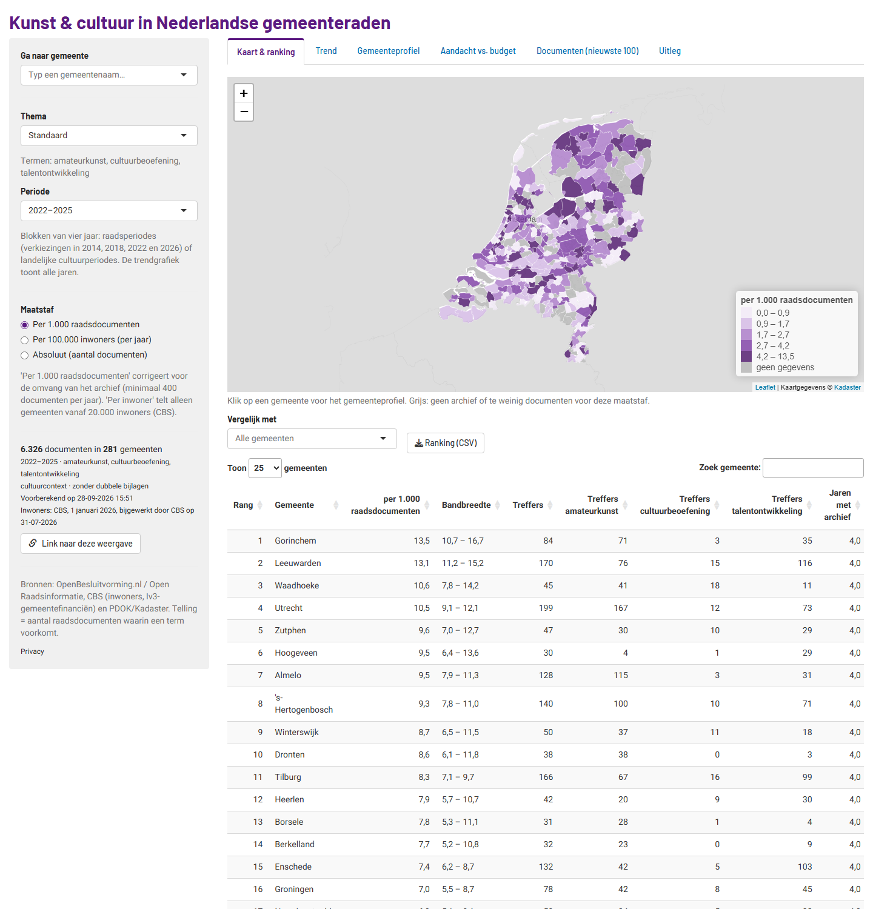
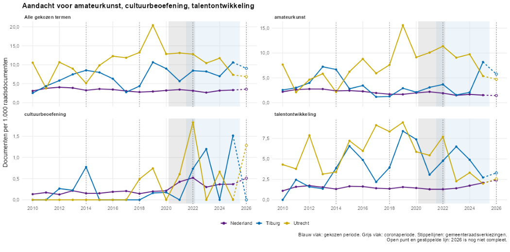
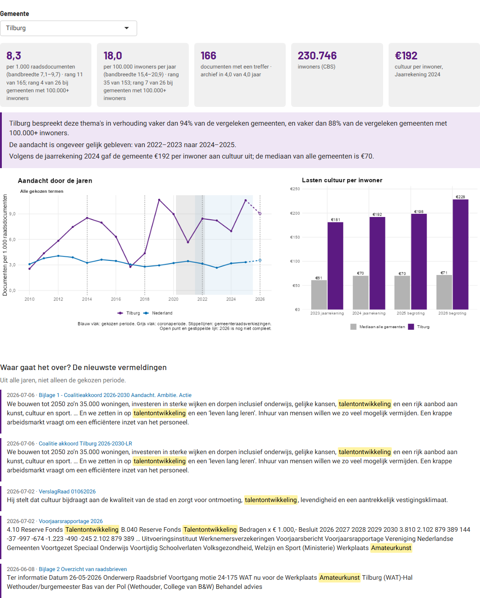
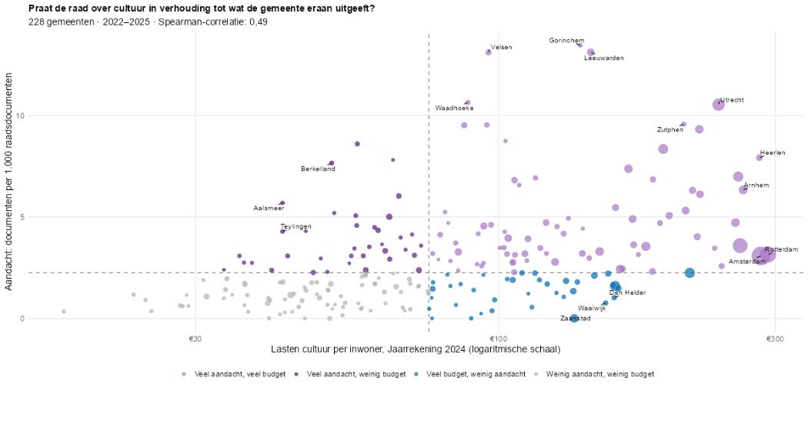

# Cultuur in de raad

[](https://github.com/alex-janse/cultuur-in-de-raad/actions/workflows/test.yml)
[](https://github.com/alex-janse/cultuur-in-de-raad/actions/workflows/voorbereken.yml)
[](LICENSE)

Hoe vaak praten Nederlandse gemeenteraden over amateurkunst, cultuureducatie,
cultuurbeoefening en verwante onderwerpen? En hoe verhoudt die aandacht zich
tot wat een gemeente aan cultuur uitgeeft?

Dit R Shiny-dashboard doorzoekt de raadsdocumenten van ongeveer 290 gemeenten
via [OpenBesluitvorming.nl](https://openbesluitvorming.nl) en combineert die
met open data van het CBS en PDOK. Alle bronnen zijn gratis en openbaar.

**[Open het dashboard](https://01a0d57f-3a32-a4ab-9874-1761a480a727.share.connect.posit.cloud/)** ·
[Projectpagina](https://alex-janse.github.io/cultuur-in-de-raad/) ·
[Roadmap](ROADMAP.md)

> De app draait gratis op Posit Connect Cloud. Na een stille periode duurt het
> opstarten even.



## Wat kun je ermee?

- **Thema's en periodes**: kies een thema (zoals *Cultuurparticipatie* of
  *Landelijke regelingen*) en een periode van vier jaar: een raadsperiode
  (2014–2017, 2018–2021, 2022–2025, 2026–nu), een landelijke cultuurperiode
  (2017–2020, 2021–2024, 2025–nu) of alle jaren (2010–nu). Alles is
  voorberekend, dus direct beschikbaar. Vrij zoeken op eigen termen staat
  voorlopig uit (zie [Technische opzet](#technische-opzet)).
- **Kaart en ranking**: alle gemeenten ingekleurd naar aandacht, met een
  sorteerbare en doorzoekbare ranking. Maatstaven:
  - per 1.000 raadsdocumenten (corrigeert voor de omvang van het archief);
  - per 100.000 inwoners per jaar;
  - absoluut.
- **Vergelijkbare gemeenten**: rang binnen de eigen grootteklasse.
- **Trend**: aandacht per jaar sinds 2010, per term, voor maximaal vier
  gemeenten naast heel Nederland. De gekozen periode, de coronaperiode en de
  verkiezingen (of starts van landelijke cultuurperiodes) zijn gemarkeerd.
- **Gemeenteprofiel**: kerncijfers, een korte samenvatting in gewone taal, de
  trend, de cultuurlasten per inwoner (2023–2026) en de nieuwste vermeldingen
  met de zin waarin de term staat.
- **Aandacht vs. budget**: welke gemeenten praten veel over cultuur maar geven
  er weinig aan uit, en omgekeerd?
- **Uitleg**: een tabblad met de methode en kanttekeningen in gewone taal.
- **Export en delen**: CSV (Excel-vriendelijk), PNG en een deelbare link die
  thema, periode en keuzes bewaart.

| Trend | Gemeenteprofiel |
|---|---|
|  |  |



## Technische opzet

- **Geen live verzoeken aan de API**: de app gebruikt alleen voorberekende
  data. Een trage of overbelaste API van OpenBesluitvorming raakt bezoekers
  dus niet. Vrij zoeken (eigen termen, periode en opties) zit nog in de code
  en gaat aan met `VRIJ_ZOEKEN <- TRUE` in `R/config.R`; die zoekvragen lopen
  dan asynchroon (`shiny::ExtendedTask` + `mirai`).
- **Nachtelijke voorberekening**: een GitHub Action rekent elk thema over alle
  jaren uit (in delen van acht jaar, `PERIODE_DEEL_JAREN`, zodat elk verzoek
  licht blijft voor de server), plus per gemeente de nieuwste vermeldingen
  met fragment en per jaar de nieuwste documenten. De app telt de
  periodeblokken daaruit op. Ook CBS-cijfers en gemeentegrenzen staan op de
  tak [`data`](../../tree/data). De app controleert inhoud, schemaversie en
  leeftijd voordat ze die gebruikt.
  CBS-cijfers en gemeentegrenzen worden alleen opnieuw gedownload als de bron
  een nieuwe versie heeft; de app toont wanneer CBS de cijfers bijwerkte.
  Een uitkomst die meer dan 20% afwijkt van de vorige wordt pas gepubliceerd
  als de volgende nacht hetzelfde geeft; wat mislukt, laat de vorige versie staan.
- **Snel bij veel bezoekers**: getekende grafieken en kaartdata worden
  gedeeld tussen bezoekers (`bindCache`), dus wie hetzelfde thema en dezelfde
  periode bekijkt, krijgt ze direct.
- **Zuinig met de API**: één nachtelijke run met pauzes tussen de verzoeken,
  en een nette afhandeling van HTTP 429. Let op: een 429 kan ook betekenen dat
  de server van OpenBesluitvorming geheugen tekortkomt
  (`circuit_breaking_exception`); dan weigert hij alle verzoeken.
- **Verantwoorde cijfers**: correctie voor archiefomvang en archiefdekking,
  een 95%-interval (exact Poisson) bij elke waarde, en geen rang bij te weinig
  treffers. Zie [Hoe wordt er geteld?](#hoe-wordt-er-geteld).
- **Getest**: testthat-tests zonder netwerk (met vaste voorbeelden) draaien
  bij elke push via GitHub Actions, inclusief een controle of het
  deploymanifest bij de code past.
- **Veilig**: bronteksten worden ge-escaped, CSV-exports zijn beschermd tegen
  formule-injectie en de Actions staan vast op een commit-SHA.
- **Gefaseerd ontwikkeld**: elke fase (stabiliteit, correcte cijfers,
  veiligheid, gebruiksgemak) is een eigen pull request; zie de
  [roadmap](ROADMAP.md).

## Hoe wordt er geteld?

- **Telling**: het aantal raadsdocumenten (stukken, bijlagen, agendapunten)
  waarin een term voorkomt, niet het aantal keer dat de term genoemd wordt.
  De term wordt gezocht als exacte woordgroep in de titel, de beschrijving en
  de volledige tekst.
- **Dubbele bijlagen samenvoegen** (standaard aan): dezelfde bijlage hangt
  vaak bij meerdere agendapunten. Binnen een gemeente tellen bestanden met
  precies dezelfde grootte één keer, zowel bij de treffers als in de noemer.
  - Dat scheelt ongeveer 15% van de treffers en 10% van het archief.
  - De bestandsnaam is geen goede sleutel: veel bestanden heten
    "Bijlage 1.pdf".
  - Gemeten (september 2026): het effect hangt niet samen met de grootte van
    het archief (correlatie −0,02), dus grote gemeenten worden er niet door
    bevoordeeld. Toevallig even grote, verschillende bestanden komen weinig
    voor: in Utrecht (2024) hooguit ~2%.
  - De landelijke trend is de som van de gemeenten, zodat identieke stukken
    van verschillende gemeenten niet worden samengevoegd.
  - De server telt unieke bestanden exact tot 3.000 per gemeente, jaar en term
    (`PRECISIE_UNIEK`) en schat daarboven. Dat speelt alleen bij de
    archiefomvang van grote steden. Gemeten (september 2026, tegenover een
    grens van 40.000): de treffers zijn gelijk, de archiefomvang wijkt
    hooguit 1% af. Een hogere grens kost de server veel meer geheugen.
- **Alleen in cultuurcontext** (standaard aan): een term die zelf niet over
  cultuur gaat (zoals *talentontwikkeling*) telt alleen als binnen 15 woorden
  een cultuurwoord staat (cultuur, kunst, muziek, theater, museum, erfgoed,
  bibliotheek, …). Zonder deze eis gaat twee derde van de treffers voor
  *talentontwikkeling* over sport, onderwijs of jeugd.
- **Woordvormen** (optioneel, voor één woord vanaf 4 letters, zonder
  koppelteken of spatie): *amateurkunst* vindt dan ook *amateurkunstenaars*.
- **Jaren met archief**: per gemeente tellen alleen de jaren mee waarin het
  archief minstens 50 documenten heeft, en het lopende jaar naar rato. Zo
  worden gemeenten met een later begonnen of onvolledig archief niet
  benadeeld.
- **Per 1.000 raadsdocumenten**: de noemer is het aantal documenten van die
  gemeente in dezelfde periode. Gemeenten met minder dan 400 documenten per
  jaar met archief tellen bij deze maatstaf niet mee.
- **Per 100.000 inwoners per jaar**: de treffers uit de jaren met archief,
  gedeeld door die jaren, en alleen voor gemeenten vanaf 20.000 inwoners. Kleinere gemeenten produceren
  ongeveer evenveel raadsstukken en zouden anders bovenaan staan.
- **Bandbreedte en ranking**: bij elke waarde staat een 95%-interval (exact
  Poisson). Gemeenten met minder dan 10 treffers krijgen geen rang, omdat hun
  plek dan vooral toeval is. Een gemeente met archief maar 0 treffers telt als
  echte nul.
- **Validatie**: met [`scripts/validatie.R`](scripts/validatie.R) trek je per
  term een willekeurige steekproef van treffers om te beoordelen ("gaat dit
  over het onderwerp?"); het script berekent daarna de precisie per term.
- **Budget**: gemeentelijke lasten per inwoner voor de taakvelden 5.3
  cultuur, 5.4 musea, 5.5 erfgoed en 5.6 media/bibliotheek, uit de
  Iv3-gemeentefinanciën van het CBS (jaarrekening 2023/2024, begroting
  2025/2026). Kapitaallasten en verrekeningen tellen mee; het bedrag is dus
  een indicatie.

## Kanttekeningen

- **Niet alle gemeenten doen mee**: 51 van de 342 gemeenten hebben geen
  archief in OpenBesluitvorming; die zijn grijs op de kaart.
- **Archieven verschillen in lengte en hebben soms gaten**: de app deelt
  alleen door de jaren met archief, maar vergelijk liefst binnen één periode.
- **Fusiegemeenten**: archieven van opgeheven gemeenten (Weesp, Beemster,
  Cuijk, Boxmeer, Brielle, …) tellen mee bij de huidige gemeente, tot de
  fusiedatum. Heeft niet elke voorganger een archief (Voorne aan Zee: geen
  Hellevoetsluis), dan telt 'per 100.000 inwoners' alleen de jaren vanaf de
  fusie (`ONVOLLEDIGE_FUSIES` in `R/config.R`).
- **Samenvoegen per jaar**: dubbele bijlagen worden per jaar samengevoegd; een
  periode is de som van haar jaren. Een bijlage die in twee jaren van een
  periode wordt besproken, telt dus twee keer (in de praktijk tot ongeveer 6%
  verschil met samenvoegen over de hele periode).
- **Vroege jaren**: vóór 2016 hebben minder gemeenten een archief (2010: 119,
  2014: 217, vanaf 2019: ongeveer 280). Vergelijk daarom liefst binnen één
  periode; de app deelt wel altijd alleen door de jaren met archief.
- **Nieuwste vermeldingen**: het gemeenteprofiel toont de vijf nieuwste
  vermeldingen uit alle jaren, niet alleen uit de gekozen periode.
- **Aandacht is geen beleid**: een vermelding kan in een besluit staan, maar
  ook in een bijlage of een verworpen motie. Het gemeenteprofiel toont de
  zinnen, zodat je dat kunt nagaan.

## Privacy en veiligheid

- **Bron**: het dashboard toont gegevens uit openbare raadsstukken, zoals
  gemeenten die publiceren en OpenBesluitvorming.nl ze beschikbaar maakt.
- **Geen opslag**: er worden geen raadsstukken of gegevens van bezoekers
  opgeslagen; alleen een deelbare link bevat je zoekinstellingen.
- **Geen fragmenten uit gevoelige stukken**: bij stukken waarin vaak gegevens
  van burgers staan (bezwaren, inspraak, zienswijzen, ingekomen brieven,
  petities, Woo-verzoeken) toont het profiel alleen de titel met een link
  naar de bron. Herkenning gebeurt op de titel (`PRIVACY_TITELS` in
  `R/config.R`).
- **Verwijderen**: staat er iets over jou in een raadsstuk dat daar niet
  hoort, dan kan dat alleen bij de bron worden verwijderd (de gemeente en
  OpenBesluitvorming.nl). Daarna verdwijnt het hier vanzelf na de nachtelijke
  bijwerking: meestal binnen een dag, uiterlijk na ongeveer een week.
- **Veiligheid**: tekst uit de bron wordt altijd ge-escaped, links worden
  alleen getoond als ze met `http(s)://` beginnen, CSV-downloads zijn
  beschermd tegen formules (`=`, `+`, `-`, `@`) en voorberekende bestanden
  worden alleen gebruikt als ze uitsluitend gewone gegevens bevatten.

## Zelf draaien

Je hebt R 4.4 of nieuwer nodig. Installeer eenmalig de pakketten:

```r
install.packages(c("shiny", "bslib", "httr2", "jsonlite", "dplyr", "tidyr",
                   "leaflet", "ggplot2", "ggrepel", "DT", "cbsodataR", "sf",
                   "cachem", "mirai"))
```

Start daarna de app vanuit deze map:

```r
shiny::runApp()
```

De app leest de voorberekende data van de tak `data` op GitHub; zonder die
data (bijvoorbeeld vlak na een methodewijziging) meldt hij dat de gegevens
nog niet beschikbaar zijn. Met `VRIJ_ZOEKEN <- TRUE` gaan eigen zoekvragen
live naar de API (ongeveer 15 seconden) en blijven ze een uur in het
geheugen.

De nachtelijke voorberekening kun je ook zelf starten, via het tabblad
*Actions* op GitHub of lokaal. Bij een handmatige run op GitHub kun je
aanvinken:

- *CBS-cijfers en gemeentegrenzen opnieuw ophalen*: ook zonder nieuwe versie
  bij CBS downloaden;
- *Oude zoekresultaten laten staan*: bij een nieuwe versie van de app met
  andere sleutels. Start de run dan vóór het mergen op de nieuwe tak, zodat
  de huidige app blijft werken tot de nieuwe online staat.

Lokaal:

```sh
Rscript scripts/voorbereken.R uitvoer
```

Schermafbeeldingen voor README en projectpagina opnieuw maken, en een
loadtest met N gelijktijdige bezoekers tegen de online app. Beide gebruiken
een headless Chrome (pakketten `chromote` en `callr`) en doen geen verzoeken
aan de API van OpenBesluitvorming:

```sh
Rscript scripts/screenshots.R
Rscript scripts/loadtest.R 1 5 10 20
```

Tests draaien (zonder netwerk):

```sh
Rscript -e "testthat::test_dir('tests/testthat')"
```

Posit Connect Cloud publiceert alleen wat in `manifest.json` staat. Maak dat
opnieuw na nieuwe bestanden in `R/` of nieuwe pakketten:

```r
rsconnect::writeManifest(appFiles = c("app.R", list.files("R", full.names = TRUE)))
```

## Projectstructuur

```
app.R              UI en server
R/config.R         termen, themasets, cultuurwoorden, fusies, CBS-tabellen
R/api_ori.R        zoekvragen aan OpenBesluitvorming (Elasticsearch)
R/cbs.R            inwoners en cultuurlasten (CBS), controle op nieuwe versies
R/geo.R            gemeentegrenzen (PDOK)
R/kaart.R          kaartopbouw
R/plots.R          grafieken
R/ranking.R        ranking met bandbreedte
R/cache.R          schijf-, geheugen- en procescache
R/voorberekend.R   voorberekende data lezen en controleren, periodeblokken optellen
R/nachtrun.R       nachtelijke run: bijwerken, afkeuren, opruimen, delen samenvoegen
R/export.R         CSV-export
R/namen.R          naamnormalisatie en opmaak
R/uitleg.R         tabblad Uitleg
scripts/           nachtelijke voorberekening, validatie, schermafbeeldingen en loadtest
tests/testthat/    tests met vaste voorbeelden (fixtures)
docs/              projectpagina (GitHub Pages) en screenshots
.github/workflows/ tests en nachtelijke voorberekening
```

## Bronnen

- **Raadsdocumenten**: [OpenBesluitvorming.nl](https://openbesluitvorming.nl) /
  Open Raadsinformatie van de [Open State Foundation](https://openstate.eu).
- **Inwoners en gemeentefinanciën**: [CBS](https://www.cbs.nl), open data
  (CC BY 4.0). Tabellen 70072ned, 03759ned en de Iv3-tabellen voor gemeenten.
- **Gemeentegrenzen en achtergrondkaart**: [PDOK](https://www.pdok.nl) /
  CBS en Kadaster.

## Licentie

De code valt onder de MIT-licentie, zie [LICENSE](LICENSE). Voor de data
gelden de voorwaarden van de bronnen hierboven.
